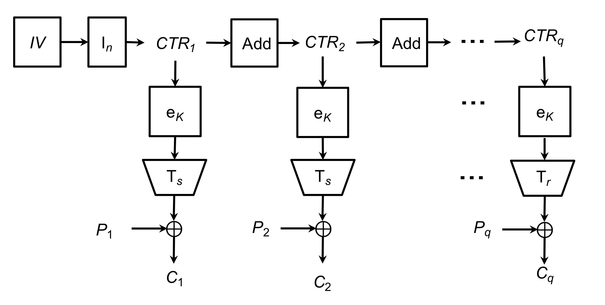

# Алгоритм ГОСТ 34.12-2015 ("Кузнечик") на CUDA

В данной работе реализован алгоритм Кузнечик с использованием технологии Nvidia CUDA. Для запусков применялся сервер с Nvidia Tesla K20x.

Алгоритм реализован с использованием LS-таблиц замены. То есть вместо обычного применения LSX(a) преобразования (xor с ключом, нелинейное преобразование по pi-таблице, линейное преобразование с использованием РСЛОС) применяется предрасчитанная таблица LS-преобразования на 64КБ.

Для реализации параллелизации алгоритма был взят режим шифрования с гаммированием (CTR):

Схема из ГОСТ 34.13-2015

Для тестов были выполнены запуски с данными размера 128 256 512 1024 1536

| МБ:   | 128  | 256  | 512  | 1024 | 1536 |
|-------|------|------|------|------|------|
| МБ/с: | 1776 | 1784 | 1787 | 1790 | 1790 |
